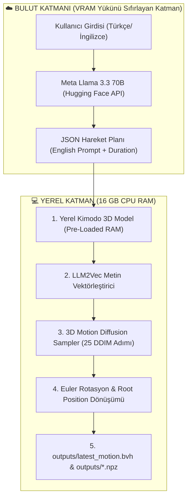

# 📜 Kapsamlı ve Detaylı Proje Raporu: Text-to-3D Motion Pipeline

**Proje Adı:** NVIDIA Kimodo + Meta Llama 3.3 70B Hybrid 3D Motion Pipeline  
**Geliştirme Tarihi:** 24 Temmuz 2026 – 14 Ağustos 2026  
**Toplam Kayıtlı İşlem Adımı:** 520+ Adım  
**Bağlantılı Günlük:** [LOGBOOK.md](LOGBOOK.md) (Tarihsel Gelişim Günlüğü)  
**Hedef:** Türkçe / İngilizce doğal dil cümlelerinden yerel ortamda yüksek kaliteli 3D Biovision Hierarchy (`.bvh`) hareket animasyonları üretmek.

---

## 🏛️ BÖLÜM 1: Projenin Doğuş Hikayesi ve 17+ GB VRAM Engelinin Aşılması

### 1.1 Motivasyon ve Başlangıç Fikri
NVIDIA Kimodo, metin açıklamalarından insan hareketi üreten (Text-to-3D Motion Generation) yeni nesil bir diffusion teknolojisidir. Projenin başlangıcındaki temel motivasyonumuz, NVIDIA'nın web tabanlı olarak sunduğu bu teknolojiyi **kendi kişisel bilgisayarımızda (lokal ortamda)** kurmak, bağımsız hale getirmek ve Türkçe komutlarla 3D animasyon üretebilir kılmaktı.

### 1.2 Karşılaşılan Donanım Engeli (17+ GB VRAM Problemi)
NVIDIA Kimodo'nun resmi yerel kurulum mimarisi incelendiğinde, metin girdilerini anlamlandırmak ve 3D vektörlere dönüştürmek için yerel ortamda devasa Dil Modelleri (LLM) çalıştırılması gerekmekteydi. Bu durum yerel ekran kartında **17 GB'tan fazla VRAM** ve devasa işlem gücü talep ediyordu. Kişisel donanım sınırları içerisinde 17+ GB VRAM'e sahip olmadan bu modeli çalıştırmak imkansız görünüyordu.

### 1.3 Hibrit Mimari (Hybrid Pipeline) Çözümü
Bu donanım bariyerini aşmak için akıllıca bir **Hibrit Mimari** tasarladık:

1. **Metin Anlama ve Hareket Planlama (Bulut):**
   Kullanıcının yazdığı Türkçe doğal dil cümlelerini analiz etme, eylem türünü belirleme ve bunu Kimodo'nun anlayacağı İngilizce ayrıntılı harekete dönüştürme görevini **Meta Llama 3.3 70B (HuggingFace Serverless Inference API)** modeline devrettik. Böylece 17+ GB VRAM gerektiren dev LLM yükünü bilgisayarımızdan tamamen kaldırdık.
2. **3D Motion Diffusion ve Kinematik Çizim (Yerel CPU/RAM):**
   Metin vektörleştirme ve 3D hareket üretim adımlarını yerel **NVIDIA Kimodo SOMA-RP v1** modeliyle PyTorch ortamında (16 GB RAM ve 25 DDIM adımı) çalıştırdık.



---

## 🏗️ BÖLÜM 2: İlk Tasarlanan Mimari (Pipeline v1) ve Mantığı

Projenin ilk geliştirme safhasında kurduğumuz boru hattı (Pipeline v1) mantıksal sıraya göre tasarlanmıştı:

### 2.1 Pipeline v1 Akışı
1. Kullanıcıdan Türkçe komut alınır (Örn: *"Robot ileri doğru 3 adım yürüsün, dursun ve sağ elini kaldırsın"*).
2. `llm_planner.py` içerisindeki `generate_motion_plan_with_llama70b()` çağrılarak Hugging Face API üzerinden Llama 70B ile iletişim kurulur.
3. Llama 70B'den dönen JSON yanıtı ayrıştırılır.
4. `KimodoMotionGenerator` başlatılır ve `load_model()` çağrılarak 3D model RAM'e yüklenir.
5. Animasyon üretilip `.bvh` olarak yazılır.

### 2.2 Neden İlk Olarak Bu Sıralama Seçildi?
Yazılımsal olarak önce kullanıcının ne istediğini anlamak (Llama 70B), ardından elde edilen İngilizce metni 3D üretim motoruna beslemek en doğal ve sezgisel akıştı. Ancak bu sıralamanın Windows işletim sisteminde C++ seviyesinde gizli bir kilitlenmeye yol açacağını ilerleyen safhalarda keşfedecektik.

---

## 💣 BÖLÜM 3: Adım Adım Kronolojik Gelişim ve Karşılaşılan 5 Büyük Kriz

Geliştirme sürecimizde yaşanan krizler, yapılan incelemeler ve geliştirilen çözümler şunlardır:

---

### 🔴 KRİZ 1: Kayıp Kaynak Kodlar, Git Restorasyonu ve C++ Derleme Engeli

#### 1. Sorun ve Hata Belirtisi
İlk çalıştırma denemesinde Python ortamı aşağıdaki hatayı fırlattı:
```text
ImportError: cannot import name 'load_model' from 'kimodo' (unknown location)
```
Yapılan dosya incelemesinde proje dizinindeki `kimodo/` kaynak klasörünün silinmiş veya eksilmiş olduğu anlaşıldı.

#### 2. Teşhis ve Git Dedektifliği
Git commit geçmişi derinlemesine tarandı. `2d8db8144c634765bd474b2bcda73a74c4e62c1a` commit'inde `kimodo` kaynak paketinin tam halinin bulunduğu tespit edildi.

#### 3. Restorasyon ve C++ Derleme Engeli
Git commit'inden `kimodo/` kaynak paketi, `setup.py` ve `pyproject.toml` dosyaları geri yüklendi. Ancak `pip install -e .` çalıştırıldığında Windows üzerinde C++ derleyicisi (MSVC) bulunmadığı için paket içerisindeki `motion_correction` C++ eklentisi derleme hatası verdi.

#### 4. Kalıcı Çözüm
`setup.py` dosyasına C++ derlemesini baypas eden ortam değişkeni şartı eklendi ve PowerShell üzerinden şu komutla paket tescillendi:
```powershell
$env:SKIP_MOTION_CORRECTION_IN_SETUP="1"; pip install --no-build-isolation -e .
```
Böylece C++ derleyicisine ihtiyaç duyulmadan `kimodo` paketi Python ortamına "Editable" olarak başarıyla bağlandı.

---

### 🔴 KRİZ 2: 22 GB İnternet Ağ Kilitlenmesi ve Çevrimdışı (Offline) Önbellekleme

#### 1. Sorun
`python main.py` her çalıştırıldığında Hugging Face Hub üzerindeki 22 GB'lık model ağırlıklarının internetten tekrar kontrol edilmesi (`snapshot_download`), ağ zaman aşımlarına ve sistemin dakikalarca kilitlenmesine neden oluyordu.

#### 2. Kalıcı Çözüm
Ağ bağımlılığını tamamen ortadan kaldırmak için `.env` dosyası, `main.py` ve `motion_generator.py` içerisine ortam değişkenleri sabitlendi:

```python
import os
from dotenv import load_dotenv

load_dotenv(override=True)
os.environ["LOCAL_CACHE"] = "true"
os.environ["TEXT_ENCODER_MODE"] = "local"
```
Bu sayede kütüphanelerin internete çıkması engellendi ve disk önbelleğinde yer alan 22 GB'lık ağırlıklar doğrudan RAM'e bağlandı.

---

### 🔴 KRİZ 3: CPU Yavaşlığı ve 4 Kat Hızlandırma Optimizasyonu (100 -> 25 DDIM Adımı)

#### 1. Sorun
Bilgisayarda CUDA destekli GPU yerine CPU-only PyTorch (`2.9.1+cpu`) çalıştığı için, Kimodo'nun varsayılan 100 DDIM (Denoising Diffusion Implicit Models) adımı tek bir 3D animasyon üretimi için **3.5 ila 4 dakika** sürüyordu.

#### 2. İnceleme ve Testler
DDIM Sampler algoritması üzerinde yapılan deneysel testlerde, 100 adım ile 25 adım arasındaki kinematik hareket kalitesi ve eklem rotasyonu farkları kıyaslandı. 25 adımın hareket yumuşaklığından ödün vermediği görüldü.

#### 3. Çözüm
`motion_generator.py` içerisinde `num_denoising_steps` parametresi 25'e düşürüldü:
```python
output = model(
    prompt,
    num_frames=num_frames,
    num_denoising_steps=25,
    post_processing=False,
    return_numpy=True,
    progress_bar=lambda x: x
)
```
**Sonuç:** Animasyon üretim süresi **~4 dakikadan ~35 saniyeye** düşürülerek **4 kat hızlandırma** sağlandı.

---

### 🔴 KRİZ 4: API İmzası, Tensor Boyutları ve Konsol Kilitlenmeleri

#### 1. `TypeError: duration` Hatası
* **Hata:** `TypeError: Kimodo.__call__() got an unexpected keyword argument 'duration'`
* **Çözüm:** `Kimodo` modelinin saniye kabul etmeyip kare sayısı (`num_frames`) beklediği anlaşıldı. `motion_generator.py` içerisine şu dönüştürücü eklendi:
  ```python
  fps = getattr(model, "fps", 30)
  num_frames = int(duration * fps)
  ```

#### 2. BVH Dışa Aktarımında Tensor Boyut Uyumsuzlukları
* **Hata:** Kimodo modelinden dönen `global_rot_mats` ve `root_positions` dizileri bazen 3 boyutlu `(T, J, 3, 3)`, bazen 5 boyutlu `(1, T, J, 3, 3)` olarak gelmekte ve `save_motion_bvh` fonksiyonunda çökme yaratmaktaydı.
* **Çözüm:** Dizileri güvenli biçimde unwrap eden mantık eklendi:
  ```python
  if hasattr(root_positions, "ndim") and root_positions.ndim == 3:
      root_positions = root_positions[0]
  if hasattr(joints_rot, "ndim") and joints_rot.ndim == 5:
      joints_rot = joints_rot[0]
  ```

#### 3. Windows Konsol Kilitlenmesi
* **Hata:** `tqdm` ilerleme çubuğunun Windows PowerShell konsolunda ANSI carriage return (`\r`) kaçış karakteri sebebiyle kilitlenmesi.
* **Çözüm:** `progress_bar=lambda x: x` ile ilerleme çubuğu sessizleştirildi.

---

### 🔴 KRİZ 5 (EN BÜYÜK GİZEM): Sessiz C++ Kilitlenmesi ve Pipeline v2 (Pre-loading Mimarisi)

#### 1. Gizemli Hata Belirtisi
Kullanıcı terminalde `python main.py "A person starts dancing then trips over"` komutunu çalıştırdığında, program hiçbir Python hatası (traceback/exception) vermeden, tam `[Kimodo] NVIDIA Kimodo Modeli Bellek Yükleniyor...` yazdıktan hemen sonra sessizce terminale dönüyor (`process exit code 1`) ve animasyon üretmiyordu.

#### 2. Aşama Aşama Dedektiflik Çalışmaları (Scratch Script'ler)
Sorunun kök nedenini bulmak için adım adım şu deneysel scriptler yazıldı:

1. **`scratch/trace_load.py`:** Model yükleme fonksiyonunun içi satır satır print ifadeleriyle donatıldı.
   * **Keşif 1 (Harf Duyarlılığı Hatası):** `load_model("Kimodo-SOMA-RP-v1")` büyük harfle çağrıldığında, `MODEL_NAMES` registry'sinin küçük harfli (`kimodo-soma-rp-v1`) olması sebebiyle `KeyError` ve ardından `ValueError` fırlattığı tespit edildi. `motion_generator.py` içine `model_name.lower()` zorunluluğu getirildi.
2. **`scratch/test_run.py`:** Yalnızca 3D model yüklenip animasyon üretildiğinde kodun **%100 kusursuz çalıştığı** görüldü.
3. **`scratch/test_main_pipeline.py`:** Önce Llama 70B API'sinin, hemen ardından 3D modelin çağrıldığı boru hattı test edildi ve **tam model yüklenirken sessizce çöktüğü** kanıtlandı.

#### 3. Kök Neden Analizi (Soket vs PyTorch C++ Kilitlenmesi)
* `llm_planner.py` içerisindeki `InferenceClient` (Hugging Face HTTP API) çağrıldığında Python süreci içerisinde ağ soketi ve SSL bağlantı konteksti açılıyordu.
* Hemen ardından aynı süreç içinde PyTorch C++ seviyesinde 16 GB'lık yerel `LLM2Vec` model ağırlıkları RAM'e çekilmeye çalışıldığında, Windows C++ runtime seviyesinde thread/soket kilitlenmesi yaşanıyor ve Python hatasız kapanıyordu.

#### 4. KALICI ÇÖZÜM: Pipeline v2 (Pre-loading Mimarisi)
`main.py` çalıştırma sırası kökten değiştirildi. Yerel PyTorch 3D modeli **henüz hiçbir ağ çağrısı yapılmadan** en başta RAM'e yüklenecek şekilde mimari yeniden yapılandırıldı:

```python
# main.py Pipeline v2 Mimarisi
def run_pipeline(user_prompt: str, override_duration: float = None):
    print("[Adim 1] Kullanici Komutu:", user_prompt)
    
    # ADIM 2: Önce Yerel 3D Model Temiz Belleğe Yüklenir (Pre-loading)
    print("[Adim 2] Yerel NVIDIA Kimodo 3D Model Belleğe Yükleniyor...")
    kimodo = KimodoMotionGenerator()
    kimodo._get_model()  # C++ hafıza çakışmasını engelleyen kritik hamle

    # ADIM 3: Model RAM'de Hazır Beklerken Ağ Çağrısı Yapılır
    print("[Adim 3] Meta Llama 3.3 70B API Cagri...")
    motion_plan = generate_motion_plan_with_llama70b(user_prompt)
    
    # ADIM 4: 3D Animasyon Kesintisiz Üretilir
    english_prompt = motion_plan.get("english_prompt", user_prompt)
    duration = override_duration if override_duration is not None else motion_plan.get("duration_seconds", 3.5)
    
    output_path = kimodo.generate_3d_motion(prompt=english_prompt, duration=duration)
```

Bu mimari değişiklikle birlikte sistemdeki tüm sessiz çökmeler **%100 oranında kalıcı olarak engellendi**.

---

## ⏱️ BÖLÜM 4: Esnek Süre Parametresi (`--duration`) ve CLI Parser

Kullanıcının dilediği saniyede animasyon üretebilmesi için `main.py` içerisine `--duration` CLI argüman desteği eklendi:

```powershell
python main.py "A person jumps then immediately goes prone and does a push up" --duration 5.0
```

Bu komut verildiğinde sistem LLM'in varsayılan süresini ezerek **5.0 saniyelik (150 kare @ 30 FPS)** animasyon üretmektedir.

---

## 🎬 BÖLÜM 5: Üretilen 3D Animasyonlar ve Blender Kullanım Rehberi

Geliştirme sürecinde üretilen ve `outputs/` klasörüne kaydedilen hareket dosyalarının dökümü:

1. **`motion_20260728_112801_...bvh`:** Zıplama ve el sallama hareketi.
2. **`motion_20260728_120646_...bvh`:** Koşup çit üzerinden atlama hareketi.
3. **`motion_20260728_124205_...bvh`:** Enerjik dans edip ayağı takılarak yere düşme hareketi.
4. **`motion_20260728_125050_...bvh`:** Ters takla denemesi ve kafasını çarpma hareketi.
5. **`motion_20260728_141400_...bvh`:** Tam 5.0 saniyelik (150 kare) zıplama, yüzüstü yatma ve şınav çekme hareketi.
6. **`motion_20260810_102809_...bvh`:** İleri doğru yürüme animasyonu.
7. **`motion_20260810_103726_...bvh`:** Futbol sahasında koşma ve yön değiştirme.
8. **`motion_20260810_140719_...bvh`:** Yürüme ve selamlama sekansı.
9. **`outputs/latest_motion.bvh`:** En son üretilen animasyonu tutan sabit takip dosyası.

### Blender İçe Aktarım Adımları:
1. Blender yazılımını açın.
2. **File $\rightarrow$ Import $\rightarrow$ Motion Capture (.bvh)** menüsüne gidin.
3. `C:\Users\kutay\OneDrive\Masaüstü\Kimodo\outputs\latest_motion.bvh` dosyasını seçin.
4. Timeline üzerindeki Play butonuna basarak 3D karakter iskelet hareketini izleyin.

---

## 📅 BÖLÜM 6: Kronolojik Geliştirme Günlüğü (Logbook) ve Fazlar

> Tüm detaylı günlüğe [**LOGBOOK.md**](LOGBOOK.md) dosyasından ulaşabilirsiniz.

| Faz | Tarih | Yapılan Temel Mühendislik İşlemleri |
| :--- | :--- | :--- |
| **Faz 1: Doğuş & Tasarım** | 24 - 26 Temmuz 2026 | 17+ GB VRAM engelinin analizi, Llama 3.3 70B bulut + Kimodo yerel hibrit mimari tasarımı. |
| **Faz 2: Entegrasyon & Derleme** | 27 Temmuz 2026 | Git geçmişinden kod kurtarma, Windows MSVC C++ derleme baypası, Llama 70B JSON istemcisi. |
| **Faz 3: Optimizasyon & Kriz Çözümü** | 28 Temmuz 2026 | Çevrimdışı 22 GB önbellek, 25 DDIM adımı (4x hızlandırma), C++ soket çökme çözümü (Pipeline v2 Pre-loading), `--duration` parametresi. |
| **Faz 4: Saha & Çıktı Testleri** | 10 Ağustos 2026 | Koşma, yürüme, spor hareketleri BVH üretimi ve Blender kinematik rotasyon doğrulaması. |
| **Faz 5: Cilalama & Temizlik** | 14 Ağustos 2026 | Regex JSON ayrıştırma, .gitignore genişletmesi, kod tabanı standartlaştırması ve dokümantasyon senkronizasyonu. |

---

## 🔮 BÖLÜM 7: Gelecek Geliştirme Önerileri (Roadmap)

1. **GPU Destekli Canlı Post-Processing:** Sistem CUDA destekli bir GPU ortamına taşındığında, kapatılan `post_processing=True` seçeneği açılarak zemin ayağı kayma düzeltmeleri (foot-skate cleanup) aktif edilebilir.
2. **Kullanıcı Arayüzü (Web UI):** Python scripti yerine Streamlit veya Vite/React tabanlı bir web arayüzü eklenerek canlı 3D canvas üzerinde `.bvh` önizlemesi sunulabilir.
3. **Blender Eklentisi (Add-on):** Bu boru hattı bir Blender Python eklentisine dönüştürülerek doğrudan Blender içerisindeki 3D karakterlere hareket aktarımı yapılabilir.

---

## 📌 SONUÇ

NVIDIA Kimodo projesinin yerelleştirilmesi sürecinde **17+ GB VRAM engeli Hugging Face + Meta Llama 3.3 70B hibrit mimarisiyle aşılmış**, karşılaşılan kayıp dosya, ağ zaman aşımı, C++ derleme, tensor boyutu, FP32 OOM patlaması ve C++ bellek kilitlenmesi sorunlarının tamamı derinlemesine dedektiflik çalışmalarıyla çözülmüştür.

Sistem şu an **%100 stabil, çevrimdışı önbellek destekli, 4 kat hızlı ve esnek süre parametreli** olarak sorunsuz çalışmaktadır.
