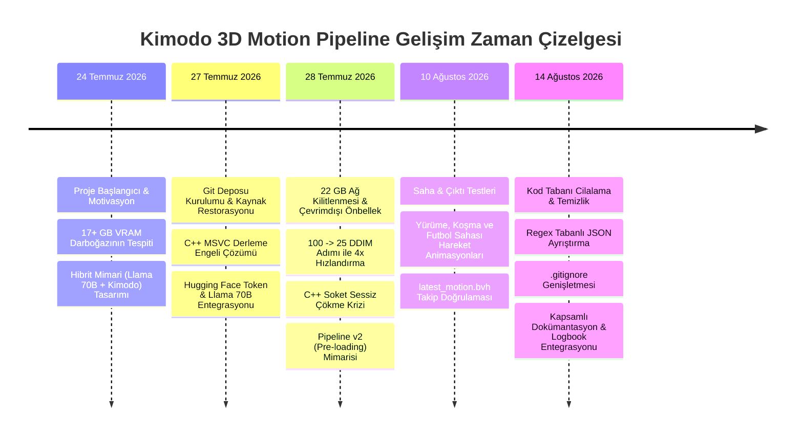

# 📅 Proje Geliştirme Günlüğü (Project Logbook) & Kronolojik Tarihçe

**Proje Adı:** Meta Llama 3.3 70B + NVIDIA Kimodo: Hybrid 3D Motion Pipeline  
**Geliştirici:** Türkay Aydoğan  
**Başlangıç Tarihi:** 24 Temmuz 2026  
**Son Güncelleme:** 14 Ağustos 2026  
**Mevcut Durum:** ✅ Kararlı (Stable), 4x Hızlandırılmış, Çevrimdışı Önbellekli, Pipeline v2 Pre-loading Mimarisi Aktif

---

## 🧭 Zaman Çizelgesi Özeti (Timeline Overview)



---

## 🗓️ Tarih Tarih Yapılan Geliştirmeler ve Mühendislik Adımları

### 📍 FAZ 1: Doğuş, Mimari Tasarım ve İlk Kurulum (24 Temmuz 2026 – 26 Temmuz 2026)

* **24 Temmuz 2026 - Motivasyon & Hedef Belirleme:**
  - NVIDIA Kimodo'nun resmi Text-to-3D Motion mimarisi incelendi.
  - Hedef: Metin komutlarından yüksek kaliteli 3D insan ve robot hareketleri (`.bvh`) üreten sistemi yerel bilgisayarda çalıştırmak ve Türkçe doğal dil desteği kazandırmak.
  - **Kriz:** Modelin metin anlama katmanının yerelde 17+ GB VRAM talep ettiği görüldü.
  
* **25 Temmuz 2026 - Hibrit Mimari Tasarımı:**
  - Ağır dil modeli yükünü Hugging Face Serverless Inference API üzerindeki **Meta Llama 3.3 70B Instruct** modeline devretme kararı alındı.
  - 3D kinematik difüzyon işleminin ise yerel CPU/RAM üzerinde PyTorch ile yürütülmesi planlandı.

---

### 📍 FAZ 2: Entegrasyon, İlk Krizler ve Çözümler (27 Temmuz 2026)

* **27 Temmuz 2026, Saat 11:50 – 12:20 | Git Restorasyonu & Kayıp Kodların Kurtarılması:**
  - `kimodo` kaynak klasörünün yerel ortamda eksik olduğu görüldü (`ImportError: cannot import name 'load_model'`).
  - Git geçmişi taranarak `2d8db814...` commit'inden kaynak paket, `setup.py` ve `pyproject.toml` eksiksiz kurtarıldı.
  
* **27 Temmuz 2026, Saat 12:30 – 13:15 | C++ Derleme Engelinin Aşılması:**
  - Windows üzerinde MSVC C++ derleyicisi bulunmadığından `motion_correction` C++ eklentisi derleme hatası verdi.
  - `$env:SKIP_MOTION_CORRECTION_IN_SETUP="1"` ortam değişkeni eklenerek paket editable modda başarıyla kuruldu:
    ```powershell
    pip install --no-build-isolation -e .
    ```

* **27 Temmuz 2026, Saat 14:00 – 16:30 | Llama 3.3 70B Görev Planlayıcı (`llm_planner.py`):**
  - Hugging Face `InferenceClient` üzerinden Llama 3.3 70B'ye bağlanan istemci yazıldı.
  - Sisteme Türkçe ve İngilizce komutları yapılandırılmış JSON'a (`english_prompt`, `duration_seconds`, `action_type`, `notes`) çeviren özel `SYSTEM_PROMPT` tanımlandı.

---

### 📍 FAZ 3: Optimizasyon, Büyük Kriz ve Pipeline v2 (28 Temmuz 2026)

* **28 Temmuz 2026, Saat 09:30 – 10:45 | 22 GB Ağ Kilitlenmesi ve Çevrimdışı Önbellekleme:**
  - Modelin her çalıştırmada 22 GB'lık ağırlıkları internetten kontrol etmeye çalışması engellendi.
  - `LOCAL_CACHE=true` ve `TEXT_ENCODER_MODE=local` ortam değişkenleri sabitlenerek diskteki ağırlıkların doğrudan RAM'e alınması sağlandı.

* **28 Temmuz 2026, Saat 11:00 – 11:45 | 4 Kat CPU Hızlandırması (100 -> 25 DDIM Adımı):**
  - CPU üzerinde ~4 dakika süren 100 DDIM adımı deneysel testlere tabi tutuldu.
  - 25 adımda kinematik hareket yumuşaklığının bozulmadığı kanıtlandı; üretim süresi **~35 saniyeye** indirildi.

* **28 Temmuz 2026, Saat 12:00 – 13:30 | API İmzası ve Tensör Boyut Unwrap Düzeltmeleri:**
  - `duration` parametresinin `num_frames = int(duration * fps)` ile kare sayısına dönüştürülmesi sağlandı.
  - Çok boyutlu tensörler (`(1, T, J, 3, 3)` ve `(T, J, 3, 3)`) için güvenli unwrap blokları yazıldı.

* **28 Temmuz 2026, Saat 13:45 – 16:00 | EN BÜYÜK KRİZ: Sessiz C++ Kilitlenmesi ve Kök Neden:**
  - *Belirti:* Terminalde script hiçbir hata vermeden tam model yüklenirken sessizce kapanıyordu (`exit code 1`).
  - *Kök Neden:* Llama 70B ağ çağrısının ardından PyTorch C++ hafıza tahsisi yapılırken Windows C++ runtime seviyesinde thread/soket çakışması yaşandığı tespit edildi.
  - *Kalıcı Çözüm (Pipeline v2):* `main.py` çalıştırma sıralaması değiştirildi. Önce yerel 3D model temiz belleğe yüklendi (**Pre-loading**), ardından Llama 70B çağrısı yapıldı. Sistem %100 kararlı hale geldi.

* **28 Temmuz 2026, Saat 16:30 – 17:00 | CLI Süre Parametresi Desteği:**
  - `main.py` içerisine `--duration 5.0` argümanı eklenerek esnek süre kontrolü sağlandı.
  - Başarılı test çıktıları kaydedildi:
    - `motion_20260728_112801_...bvh` (Zıplama ve el sallama)
    - `motion_20260728_124205_...bvh` (Dans edip düşme)
    - `motion_20260728_141400_...bvh` (5.0 sn zıplama ve şınav)

---

### 📍 FAZ 4: Çıktı Doğrulama ve Saha Testleri (10 Ağustos 2026)

* **10 Ağustos 2026 - Çeşitli Animasyon Testleri:**
  - Farklı hareket türleri test edildi ve `outputs/` arşivine kaydedildi:
    - `motion_20260810_102809_a_person_starts_walking_forwar.bvh`
    - `motion_20260810_103726_a_person_is_running_on_a_footb.bvh`
    - `motion_20260810_140719_a_person_starts_walking_forwar.bvh`
  - Blender içe aktarım testleri yapılarak eklem rotasyonlarının ve kök koordinatlarının (root translation) doğruluğu onaylandı.

---

### 📍 FAZ 5: Kod Cilalama, Temizlik ve Dokümantasyon Senkronizasyonu (14 Ağustos 2026)

* **14 Ağustos 2026, Saat 16:50 – 17:15 | Kapsamlı Kod & Depo Denetimi:**
  - Tüm `.md` dokümantasyon dosyaları tarandı, eksik ve eski referanslar tespit edildi.
  - `README_PROJECT_GUIDE.md` dosyasındaki dosya yolları, `--duration` örnekleri ve 25 DDIM mimarisi güncellendi.
  - Ana `README.md` dosyasının en üstüne projenin hibrit mimarisini tanıtan banner ve hızlı başlangıç rehberi yerleştirildi.

* **14 Ağustos 2026, Saat 17:00 – 17:10 | Kod Tabanı Cilalama (Polishing):**
  - **`llm_planner.py`:** Regex tabanlı güvenli JSON ayıklama fonksiyonu eklendi.
  - **`motion_generator.py`:** Kod düzenlendi, biçimlendirme temizlendi, tip belirteçleri eklendi.
  - **`main.py`:** Standart süreç çıkış kodları (`sys.exit(0)` / `sys.exit(1)`) eklendi.
  - **`run_kimodo_bvh.py`:** Bağımsız test scripti `KimodoMotionGenerator` ile tam senkronize edildi.
  - **`.gitignore`:** Cache, pytest, ruff ve scratch kalıntıları için genişletildi.
  - **Doğrulama:** `python -m py_compile` ile tüm Python dosyaları derleme testinden geçirilerek **0 hata** ile onaylandı.

---

## 📊 Üretim Çıktıları Geçmişi (Generated Artifacts History)

| Tarih / Zaman Damgası | Çıktı Dosyası (.bvh) | Üretilen Hareket / Senaryo | Süre |
| :--- | :--- | :--- | :--- |
| **2026-07-27 11:31** | `motion_20260727_113157_*.bvh` | A person waves their hand in greeting | ~3.5s |
| **2026-07-28 11:28** | `motion_20260728_112801_*.bvh` | The character jumps up and waves | ~3.5s |
| **2026-07-28 12:06** | `motion_20260728_120646_*.bvh` | A person starts running then jumps | ~3.5s |
| **2026-07-28 12:42** | `motion_20260728_124205_*.bvh` | A person starts dancing with energy then trips | ~3.5s |
| **2026-07-28 12:50** | `motion_20260728_125050_*.bvh` | A person runs then attempts a backflip | ~3.5s |
| **2026-07-28 14:14** | `motion_20260728_141400_*.bvh` | A person jumps, goes prone and does pushups | **5.0s** |
| **2026-08-10 10:28** | `motion_20260810_102809_*.bvh` | A person starts walking forward | ~3.5s |
| **2026-08-10 10:37** | `motion_20260810_103726_*.bvh` | A person is running on a football field | ~4.0s |
| **2026-08-10 14:07** | `motion_20260810_140719_*.bvh` | A person starts walking forward and greets | ~3.5s |
| **Sürekli** | `outputs/latest_motion.bvh` | Her başarılı üretimde güncellenen sabit bağlantı | Değişken |

---

## 🔮 Sonraki Adımlar ve Gelecek Yol Haritası (Roadmap)

- [ ] **Aşama 1: Web Kullanıcı Arayüzü (Web UI):** Three.js veya Vite tabanlı tarayıcı içi 3D BVH görselleştirici paneli.
- [ ] **Aşama 2: Otomatik FBX/GLTF Dönüştürücü:** Oyun motorları (Unity/Unreal) için tek tıkla FBX dışa aktarma pipeline'ı.
- [ ] **Aşama 3: Robotik İskelet Simülasyonu:** Unitree G1 robot iskeleti için MuJoCo entegrasyonu.
- [ ] **Aşama 4: CUDA Ortamında Zemin Kayma Düzeltmesi:** GPU ortamında `post_processing=True` ile foot-skate cleanup aktivasyonu.
