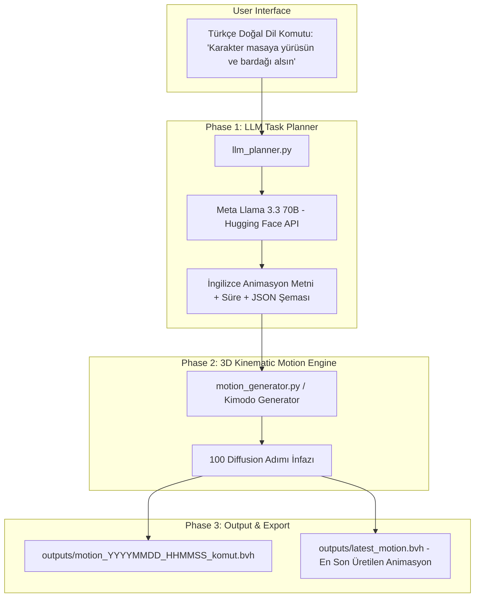

# 🚀 Meta Llama 3.3 70B + NVIDIA Kimodo Proje Kılavuzu ve Sprint El Kitabı

Bu doküman, projede şu ana kadar yapılan tüm kurulumları, dosya yapılarını, kullanım talimatlarını ve bir sonraki sprint'te kalınan yerden hızlıca devam edebilmek için gerekli geliştirme notlarını içerir.

---

## 📌 1. Proje Özeti ve Mevcut Durum

| Parametre | Değer / Durum |
| :--- | :--- |
| **Proje Konumu** | `C:\Users\kutay\OneDrive\Masaüstü\Kimodo` |
| **LLM (Beyin)** | **Meta Llama 3.3 70B Instruct** (Hugging Face Serverless Inference API) |
| **3D Motion Engine** | **NVIDIA Kimodo (Kimodo-SOMA-RP-v1)** (Yerel İnfaz & Model Ağırlıkları 22.05 GB Önbellekte) |
| **Hugging Face Token** | Konfigüre edildi (`.env` içinde saklı) |
| **Erişim İzinleri** | `Meta-Llama-3-8B-Instruct` (Gated Repo) onaylandı ve aktif |
| **Üretim Testi** | **BAŞARILI** (Tarih damgalı örn. `outputs/motion_20260727_094000_...bvh` ve kolay erişim için `outputs/latest_motion.bvh`) |

---

## 🏗️ 2. Sistem Mimarisi



---

## 📁 3. Proje Dosya Yapısı

`C:\Users\kutay\OneDrive\Masaüstü\Kimodo\`
- **`.env`**: Hugging Face Access Token'ını (`HF_TOKEN=hf_...`) barındırır.
- **`llm_planner.py`**: Kullanıcının Türkçe komutunu Meta Llama 3.3 70B API'sine gönderip İngilizce 3D hareket planı JSON'u alan modül.
- **`motion_generator.py`**: Llama 3.3 70B'den gelen çıktıyı NVIDIA Kimodo'nun resmi `kimodo.scripts.generate` CLI altyapısına bağlayarak `.bvh` ve `.npz` üreten modül.
- **`main.py`**: Tüm boru hattını tek komutla çalıştıran ana orkestratör scripti.
- **`outputs/`**: Üretilen 3D hareket animasyon çıktılarının kaydedildiği klasör:
  - **`motion.bvh`**: 3D animasyon dosyası (Blender, Unity, Unreal Engine uyumlu).
  - **`motion.npz`**: Kinematik sayısal vektör dizisi.
- **`README_PROJECT_GUIDE.md`**: Bu doküman (Sprint El Kitabı).

---

## 💻 4. Hızlı Başlangıç ve Kullanım Kılavuzu

Yeni bir hareket üretmek için izlenecek adımlar:

### Adım 1: Terminali Açın ve Proje Klasörüne Gidin
```powershell
cd C:\Users\kutay\OneDrive\Masaüstü\Kimodo
```

### Adım 2: İstediğiniz Türkçe Komutla Betiği Çalıştırın
```powershell
python main.py "Karakter zıplasın ve el sallasın"
```
veya
```powershell
python main.py "Robot koşarak gelsin, dursun ve eğilerek selam versin"
```

### Adım 3: Çıktıları İnceleyin
İşlem bittiğinde oluşan `.bvh` dosyası `C:\Users\kutay\OneDrive\Masaüstü\Kimodo\outputs\motion.bvh` adresinde hazır olacaktır.

---

## 🎬 5. Üretilen 3D Animasyonu Görüntüleme (Blender / Unity)

1. **Blender ile Görüntüleme**:
   - Blender'ı açın.
   - **File** $\rightarrow$ **Import** $\rightarrow$ **Motion Capture (.bvh)** seçeneğine tıklayın.
   - `C:\Users\kutay\OneDrive\Masaüstü\Kimodo\outputs\motion.bvh` dosyasını seçin.
   - Aşağıdaki Oynat (Play) butonuna basarak karakter hareketini izleyin.

2. **Unity / Unreal Engine ile Görüntüleme**:
   - `.bvh` dosyasını projenize sürükleyin veya Blender üzerinden `.fbx` olarak dışa aktarıp Rig ayarlarından *Humanoid* seçerek kendi 3D karakterinize giydirin.

---

## 📋 6. Gelecek Sprint Backlog (Yapılacaklar Listesi)

Bir sonraki sprint başladığında ele alınabilecek geliştirme hedefleri:

- [ ] **Görsel Arayüz (Web UI)**: Gradio veya Streamlit ile kullanıcıların tarayıcıdan metin girip canlı 3D animasyonu izleyebileceği bir web paneli eklemek.
- [ ] **Otomatik FBX Dönüştürücü**: Üretilen `.bvh` dosyalarını otomatik olarak `.fbx` formatına çeviren Python betiği entegrasyonu.
- [ ] **Çoklu İskelet Desteği**: Kimodo'nun Unitree G1 robot iskeleti checkpoint'lerini aktif ederek insansı robot simülasyon çıktısı üretmek.
