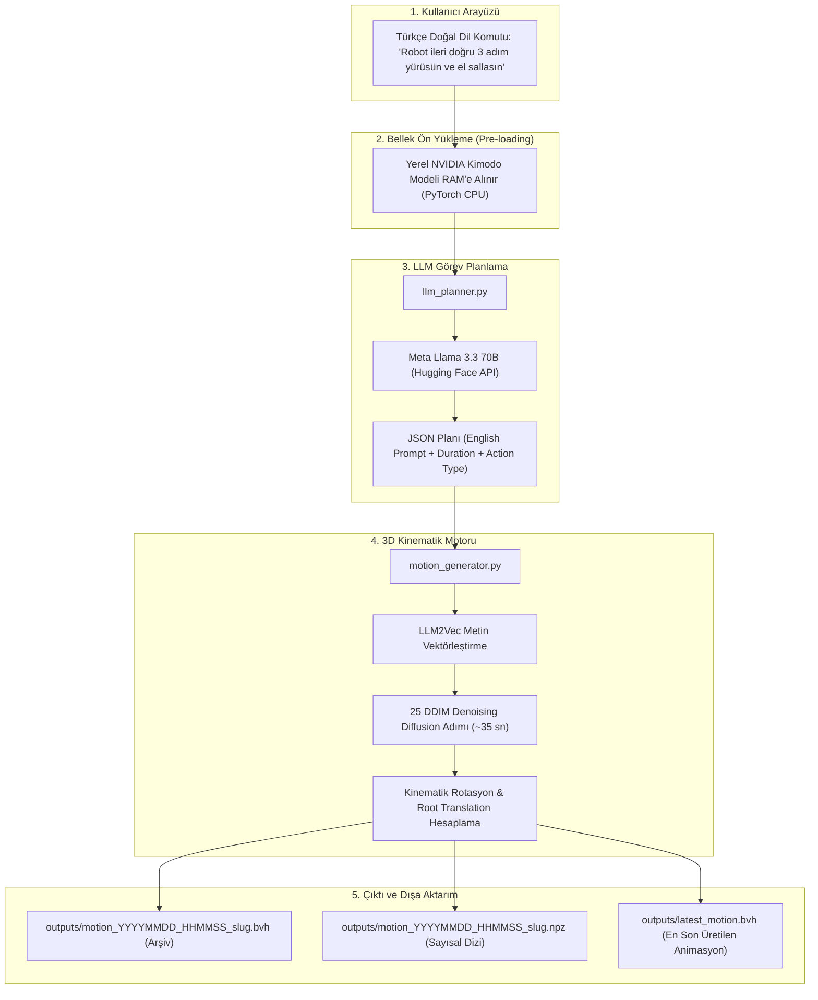

# 🚀 Meta Llama 3.3 70B + NVIDIA Kimodo Proje Kılavuzu ve Sprint El Kitabı

Bu doküman, projede yapılan tüm kurulumları, dosya yapılarını, kullanım talimatlarını ve bir sonraki sprint'te kalınan yerden hızlıca devam edebilmek için gerekli geliştirme notlarını içerir.

---

## 📌 1. Proje Özeti ve Mevcut Durum

| Parametre | Değer / Durum |
| :--- | :--- |
| **Proje Konumu** | `C:\Users\kutay\OneDrive\Masaüstü\Kimodo` |
| **LLM (Beyin / Dil Anlama)** | **Meta Llama 3.3 70B Instruct** (Hugging Face Serverless Inference API) |
| **3D Motion Engine** | **NVIDIA Kimodo (Kimodo-SOMA-RP-v1)** (Yerel İnfaz & Model Ağırlıkları 22.05 GB Disk Önbelleğinde) |
| **Hugging Face Token** | Konfigüre edildi (`.env` içinde `HF_TOKEN`) |
| **Hızlandırma Optimizasyonu** | **25 DDIM Adımı** (CPU üzerinde ~4 dakikadan ~35 saniyeye 4 kat hızlandırma) |
| **Mimari Kararlılık** | **Pipeline v2 (Pre-loading Mimarisi)** ile C++ soket kilitlenmesi %100 çözüldü |
| **Üretim Çıktıları** | Tarih damgalı `.bvh` / `.npz` arşiv dosyaları ve hızlı erişim için `outputs/latest_motion.bvh` |

---

## 🏗️ 2. Sistem Mimarisi (Pipeline v2)



---

## 📁 3. Proje Dosya Yapısı

`C:\Users\kutay\OneDrive\Masaüstü\Kimodo\`
- **`.env`**: Hugging Face Access Token'ını (`HF_TOKEN=hf_...`) barındırır.
- **`main.py`**: Pipeline v2 orkestratörü. Bellek ön yüklemesini, Llama 3.3 70B çağrısını ve `--duration` CLI parametrelerini yönetir.
- **`llm_planner.py`**: Kullanıcının Türkçe komutunu Meta Llama 3.3 70B API'sine gönderip İngilizce 3D hareket planı JSON'u alan modül.
- **`motion_generator.py`**: `KimodoMotionGenerator` sınıfı ile 25 DDIM adımlı optimize edilmiş difüzyon işlemini yürüten, tensör boyutlarını düzenleyen ve `.bvh` formatında dışa aktaran modül.
- **`run_kimodo_bvh.py`**: Doğrudan testler ve bağımsız çalıştırma scripti.
- **`kimodo/`**: NVIDIA Kimodo'nun kaynak kodları (iskelet rigleri, difüzyon modelleri, kinematik fonksiyonlar ve `.bvh` dışa aktarıcılar).
- **`outputs/`**: Üretilen 3D hareket animasyon çıktılarının kaydedildiği klasör:
  - **`latest_motion.bvh`**: En son üretilen animasyonun sabit takip dosyası (Blender veya oyun motorunda sürekli canlı izleme için).
  - **`motion_YYYYMMDD_HHMMSS_<slug>.bvh`**: Tarih damgalı ve komut açıklamalı arşiv animasyon dosyaları.
  - **`motion_YYYYMMDD_HHMMSS_<slug>.npz`**: Kinematik eklem matrisleri ve root koordinat verisi.
- **`DETAILED_PROJECT_REPORT.md`**: Projenin 5 büyük krizini ve tüm mühendislik çözümlerini açıklayan detaylı rapor.
- **`LOGBOOK.md`**: Projenin başlangıcından günümüze tarih tarih yapılan geliştirmeleri ve çıktıları içeren resmi proje günlüğü.
- **`README_PROJECT_GUIDE.md`**: Bu doküman (Sprint El Kitabı).

---

## 💻 4. Hızlı Başlangıç ve Kullanım Kılavuzu

Yeni bir hareket üretmek için izlenecek adımlar:

### Adım 1: Hugging Face Token ve `.env` Kurulumu (Tek Seferlik)
1. [Hugging Face Access Tokens](https://huggingface.co/settings/tokens) sayfasına gidin ve ücretsiz `Read` tipinde bir token oluşturun (`hf_...`).
2. `.env.example` dosyasını `.env` olarak kopyalayın ve token'ınızı ekleyin:
   ```ini
   HF_TOKEN=hf_your_token_here
   LOCAL_CACHE=true
   TEXT_ENCODER_MODE=local
   ```
*(Bu dosya `.gitignore` tarafından korunur, kesinlikle dışarı sızmaz.)*

### Adım 2: Terminali Açın ve Proje Klasörüne Gidin
```powershell
cd C:\Users\kutay\OneDrive\Masaüstü\Kimodo
```

### Adım 3: İstediğiniz Türkçe Komutla Betiği Çalıştırın

- **Varsayılan Komut ile Çalıştırma:**
  ```powershell
  python main.py
  ```

- **Özel Türkçe Komut ile Çalıştırma:**
  ```powershell
  python main.py "Karakter zıplasın ve el sallasın"
  ```
  veya
  ```powershell
  python main.py "Robot koşarak gelsin, dursun ve eğilerek selam versin"
  ```

- **Özel Süre Belirterek Çalıştırma (`--duration`):**
  ```powershell
  python main.py "Bir kişi dans etmeye başlasın, ardından ayağı takılıp yere düşsün" --duration 5.0
  ```

### Adım 4: Çıktıları İnceleyin
İşlem bittiğinde oluşan en son `.bvh` dosyası `outputs/latest_motion.bvh` adresinde ve tarih damgalı dosya adıyla `outputs/` dizininde hazır olacaktır.

---

## 🎬 5. Üretilen 3D Animasyonu Görüntüleme (Blender / Unity / Unreal Engine)

1. **Blender ile Görüntüleme**:
   - Blender'ı açın.
   - **File** $\rightarrow$ **Import** $\rightarrow$ **Motion Capture (.bvh)** seçeneğine tıklayın.
   - `C:\Users\kutay\OneDrive\Masaüstü\Kimodo\outputs\latest_motion.bvh` dosyasını seçin.
   - Zaman çizelgesindeki (Timeline) **Play** butonuna basarak karakter hareketini izleyin.

2. **Unity / Unreal Engine ile Görüntüleme**:
   - `latest_motion.bvh` veya ilgili `.bvh` dosyasını oyun motoru projenize sürükleyin.
   - Blender üzerinden `.fbx` olarak dışa aktarıp Rig ayarlarından *Humanoid* seçerek kendi 3D karakter modellerinize kolayca giydirebilirsiniz.

---

## 📋 6. Gelecek Sprint Backlog (Yapılacaklar Listesi)

Bir sonraki sprint başladığında ele alınabilecek geliştirme hedefleri:

- [ ] **Görsel Web Arayüzü (Web UI)**: Gradio, Streamlit veya Vite/Three.js ile kullanıcıların tarayıcıdan metin girip canlı 3D canvas üzerinde animasyonu anında izleyebileceği bir web paneli eklemek.
- [ ] **Otomatik FBX Dönüştürücü**: Üretilen `.bvh` dosyalarını otomatik olarak oyun motorlarına uygun `.fbx` formatına çeviren Python betiği entegrasyonu.
- [ ] **Çoklu İskelet Desteği (Unitree G1 / SMPL-X)**: Kimodo'nun Unitree G1 robot iskeleti checkpoint'lerini aktif ederek insansı robot simülasyon çıktısı üretmek.
- [ ] **CUDA / GPU Post-Processing**: GPU destekli ortama geçildiğinde `post_processing=True` aktif edilerek zemin kayma düzeltmelerini (foot-skate cleanup) devreye sokmak.
